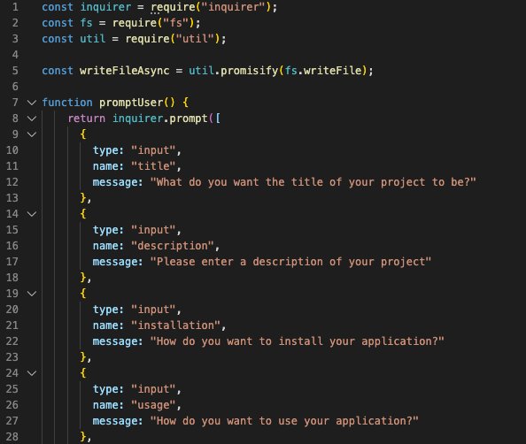
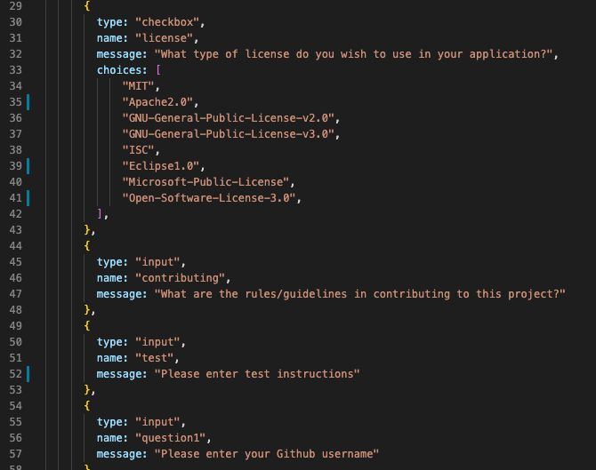
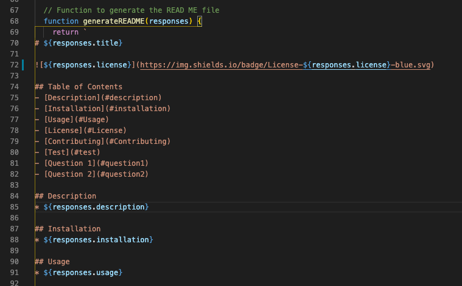
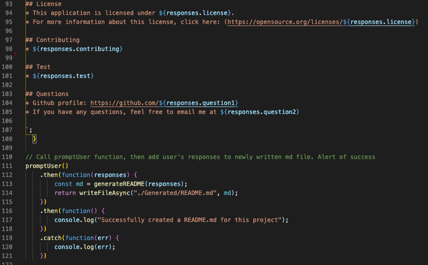
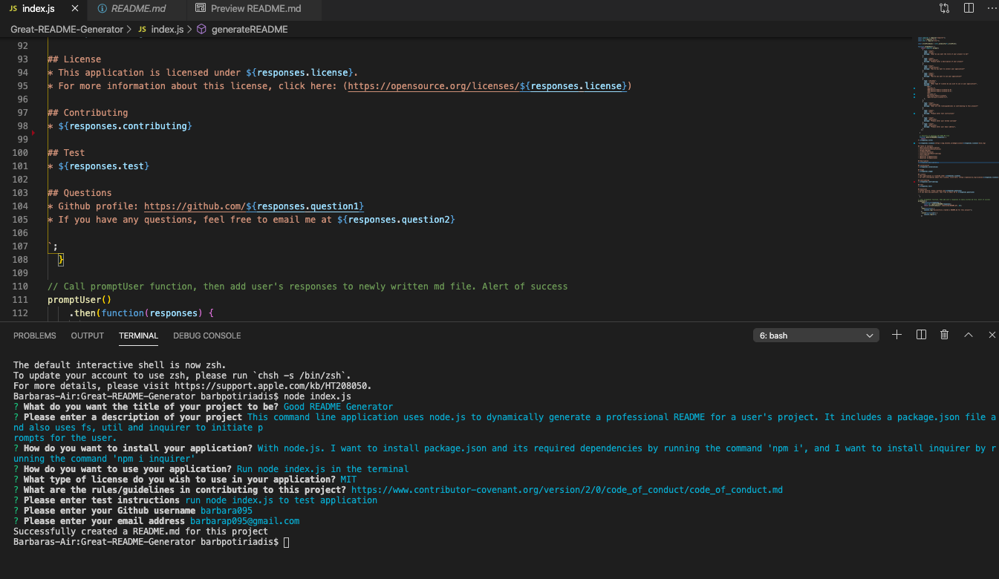
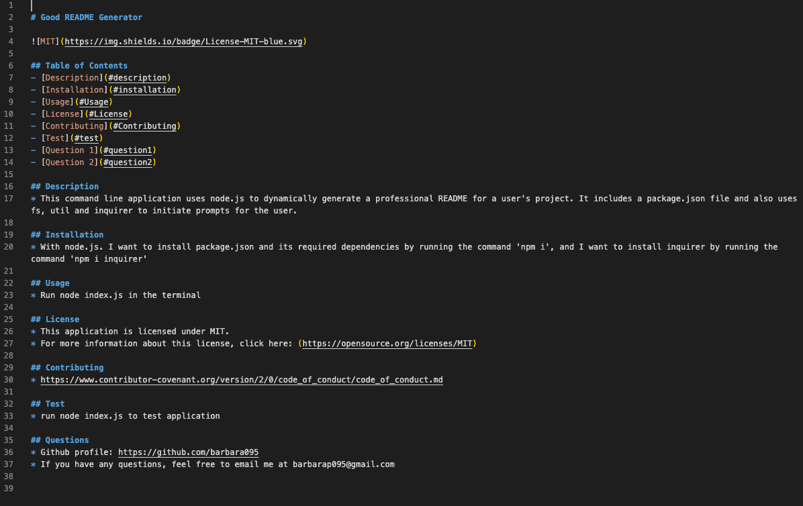
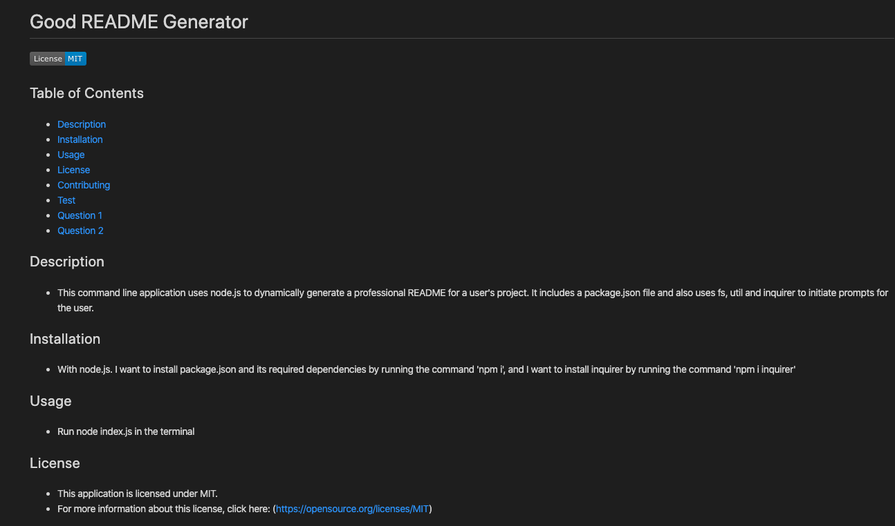
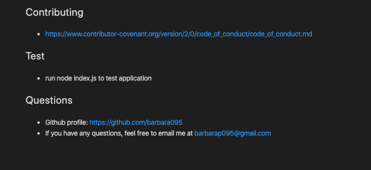

# README-Generator

## About
This command-line application uses node.js to dynamically generate a professional READ ME markdown file for a user. 
The user responds to a set of prompts which include the title of the project, description, installation, usage, license, contributing, tests and questions such as their contact details, and these get added into the project's README file. 
It includes a Table of Contents, so that when a user clicks on the links, it takes them to the respective section. 

## Motivation
The underlying aim is to simplify the user's process for creating a README file by quickly generating the file featuring sections based on the user's responses to a set of prompts. 

## Video of user flow

## Images of application

